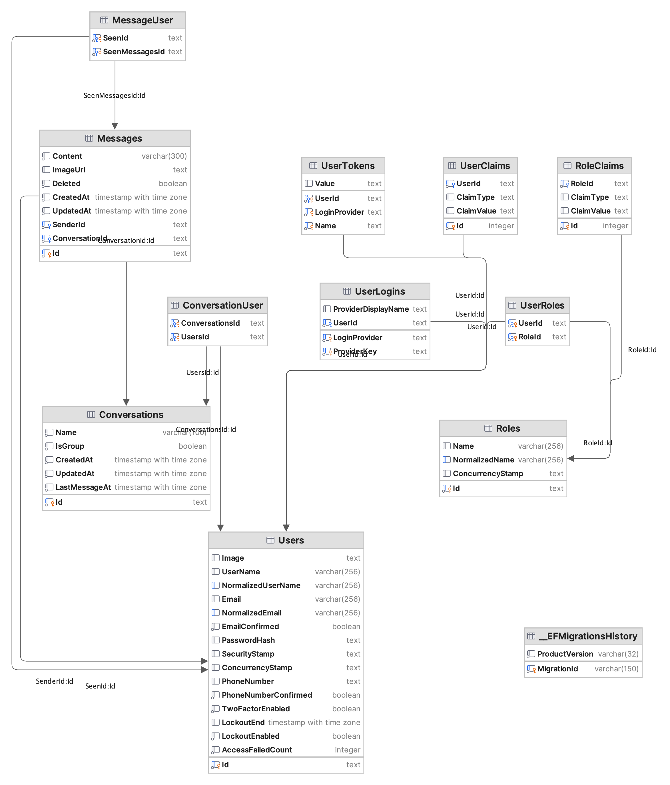

# CT240 Principle of software construction - Chat Application

### Instructions:
1. Install [Docker Desktop](https://www.docker.com/products/docker-desktop/)
2. In the Chat folder terminal, run the following command:
  ```zsh
    docker compose build && docker compose up
  ```
### Database:



